# 06 - DIAGRAMS

[[00 - START HERE|Back to start]] · Previous: [[05 - SYSTEM ARCHITECTURE]] · Next: [[07 - DEVELOPMENT ROADMAP]]

Pictures of the proposed system. Each picture has a plain-language reading beneath it, so nothing here depends on knowing how to read a diagram.

## 1. The big picture

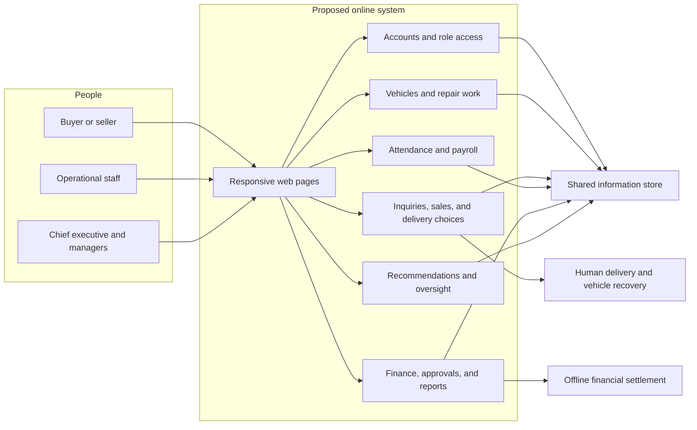

**Reading this:** Buyers, sellers, operational staff, and leaders would all enter through responsive web pages. The pages would check accounts and role access before opening the areas for vehicles, sales, payroll, finance, recommendations, and oversight. Every area would share one information store. Money would still be settled outside the system, while delivery and vehicle recovery would remain assigned human work. This picture is *drawn from* **GCE FULL CHAPTER 1 - 3.docx**, pages 15–22; **GCE ADDITIONAL DOCUMENTS.docx**, pages 1–3; and **GCE USERS LEVELS MODULES.md**, headings “CEO” through “Head Security”. It matches [[05 - SYSTEM ARCHITECTURE#The arrangement being proposed]].

## 2. How a job gets done — buying a listed vehicle

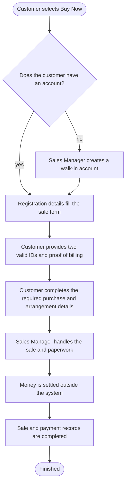

**Reading this:** Buy Now work goes to the Sales Manager. A registered customer's saved details fill the form. For a walk-in customer, the Sales Manager first creates an account, then the same sale form is used. The customer still supplies two valid IDs and proof of billing. The Sales Manager handles the sale and paperwork, while money is settled outside the system and the permitted records remain online. The exact approval checks and arrangement fields remain open questions. — **GCE FULL CHAPTER 1 - 3.docx**, page 16; **GCE USERS LEVELS MODULES.md**, headings “Sales Manager — 1. Buy Now and Inquiry Handling” through “Sales Manager — 6. Paperwork”

## 3. How a job gets done — selling a vehicle to Global Car Exchange

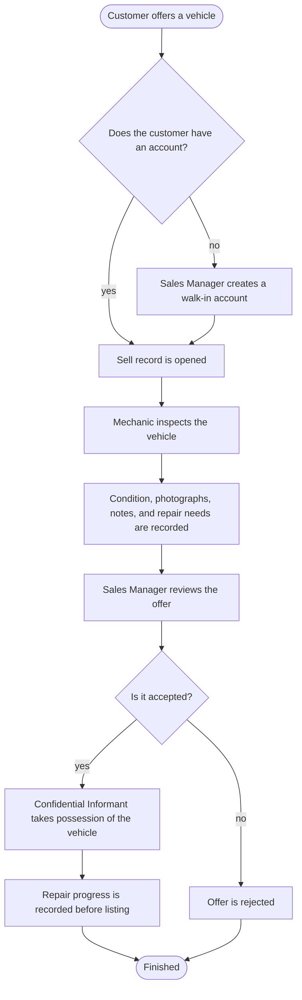

**Reading this:** A seller needs an account. The Sales Manager creates one for a walk-in seller before opening the Sell record. A mechanic inspects the vehicle and records its condition and repair needs. The Sales Manager reviews the offer. If accepted, the Confidential Informant takes possession and repair progress is recorded before listing. The exact valuation and approval rules are not supplied. — **GCE ADDITIONAL DOCUMENTS.docx**, pages 1–3; **GCE USERS LEVELS MODULES.md**, headings “Confidential Informant — 1. Car Acquisition”, “Mechanic”, and “Sales Manager — 4. Walk-In Client Selling Their Own Vehicle”

## 4. How a job gets done — requesting a vehicle

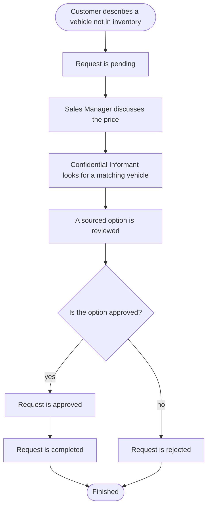

**Reading this:** The customer starts with specifications for a vehicle that is not listed. The Sales Manager discusses price, then a confidential informant searches for a match. The shared status path allows approval or rejection before completion. The material does not say what happens when several possible vehicles are found. — **GCE ADDITIONAL DOCUMENTS.docx**, page 2

## 5. The life story of a transaction

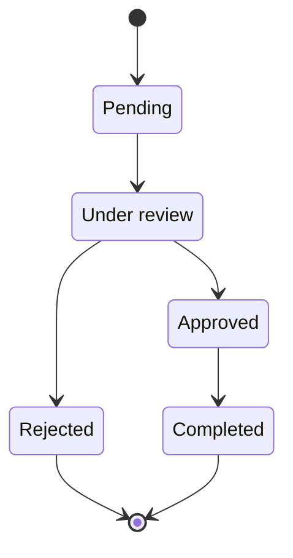

**Reading this:** Every Buy, Sell, and Request-a-Car record begins as pending. It then moves under review. Review ends in approval or rejection. An approved transaction can be completed; a rejected one ends. The additional document writes the statuses in one line, but this picture treats approval and rejection as separate paths because a rejected transaction cannot sensibly continue to completion. That branch is *drawn from* **GCE ADDITIONAL DOCUMENTS.docx**, page 2.

## 6. How the recommendation is produced

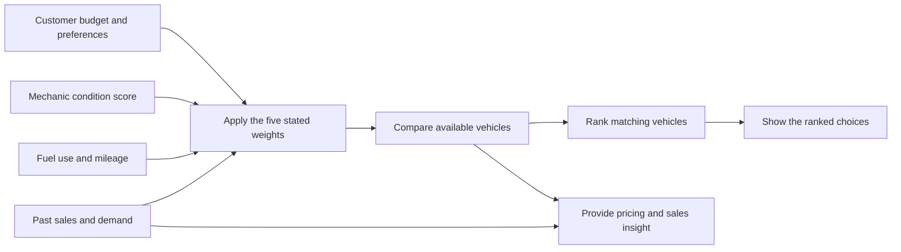

**Reading this:** The customer-facing path combines budget and preferences with mechanic findings, vehicle details, and past demand. The fixed weights are then applied before available vehicles are ranked. The chapter document separately asks for management pricing and sales insight. Whether these are one Decision Support System or two related tools remains [[00 - START HERE#Open questions|Q-05]]. — **GCE FULL CHAPTER 1 - 3.docx**, pages 16 and 19–20; **GCE ADDITIONAL DOCUMENTS.docx**, pages 2–3

## 7. The order of the phases

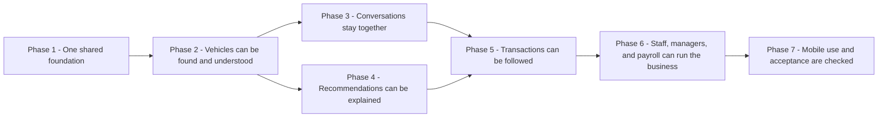

**Reading this:** The shared people and information foundation starts first. Vehicle records follow because conversations and recommendations both need a vehicle to refer to. Conversations and recommendations can then be developed alongside each other. Transactions need both. Staff, management, finance, and payroll work build on the earlier records, and the final phase checks the complete experience on phones and with intended users. This order is *drawn from* **GCE FULL CHAPTER 1 - 3.docx**, pages 14–22; **GCE ADDITIONAL DOCUMENTS.docx**, pages 1–3; and **GCE USERS LEVELS MODULES.md**, headings “CEO” through “Head Security”. It matches [[07 - DEVELOPMENT ROADMAP#The phases at a glance]].

## 8. The proposed arrangement

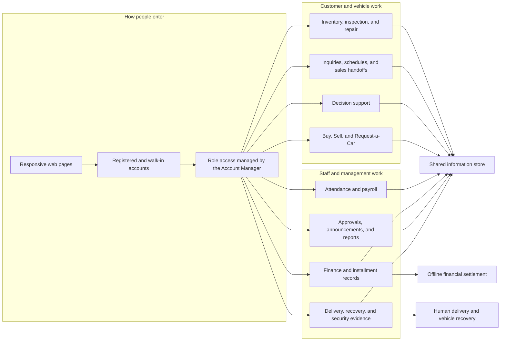

**Reading this:** One responsive entry point accepts registered accounts and the walk-in accounts created by the Sales Manager. Role checks decide which work each person can reach. Customer, vehicle, payroll, finance, approval, delivery, and security areas all share the same information. Financial settlement and physical vehicle movement cross the boundary into human work outside the program. This proposed arrangement is *drawn from* **GCE FULL CHAPTER 1 - 3.docx**, pages 15–22; **GCE ADDITIONAL DOCUMENTS.docx**, pages 1–3; and **GCE USERS LEVELS MODULES.md**, headings “CEO” through “Head Security”. The current arrangement cannot be verified, as explained in [[05 - SYSTEM ARCHITECTURE#The arrangement today]].

## 9. Payroll handoff

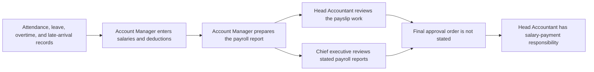

**Reading this:** Employee time and request records feed the Account Manager's payroll preparation. The Account Manager enters salaries and deductions and prepares the report. The source separately gives payslip review work to the Head Accountant and report approval work to the chief executive. It then gives salary-payment responsibility to the Head Accountant. The order between those approvals is not stated, so the middle of the handoff remains [[00 - START HERE#Open questions|Q-13]]. — **GCE USERS LEVELS MODULES.md**, headings “CEO — 2. Approval and Rejection of Reports”, “Account Manager — 4. Attendance, Leave, and Overtime Records; Payroll Processing; and Reconditioning Disbursements”, and “Head Accountant — 2. Payroll” through “Head Accountant — 6. Attendance Monitoring”

## 10. Installment escalation and vehicle recovery

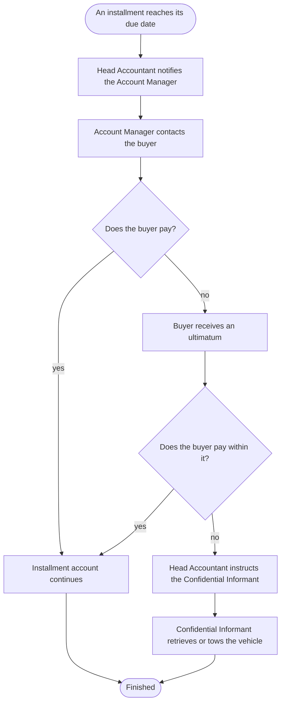

**Reading this:** The Head Accountant watches installment due dates and asks the Account Manager to contact a late buyer. If payment is still missing after an ultimatum, the Head Accountant instructs the Confidential Informant to retrieve or tow the vehicle. The source does not state the ultimatum length or whether another approval is required, so those points remain [[00 - START HERE#Open questions|Q-15]]. — **GCE USERS LEVELS MODULES.md**, headings “Head Accountant — 5. Installment Accounts” and “Confidential Informant — 3. Repossession”

## 11. Supplier registration and approval

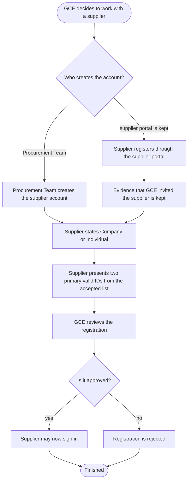

**Reading this:** The revision list prefers the Procurement Team creating the supplier account outright. If a separate supplier portal is kept instead, the system must also hold evidence that GCE invited that supplier. Both paths then require a Company or Individual declaration and two primary valid IDs. Sign-in stays closed until GCE approves. The source does not say who the Procurement Team is, whether the portal is kept, or which IDs are accepted, so those points remain [[00 - START HERE#Open questions|Q-19]], [[00 - START HERE#Open questions|Q-20]], and [[00 - START HERE#Open questions|Q-21]]. — **REVISIONS LISTS.md**, heading “5. Supplier Registration and Account Management”

## 12. Checklist to inspection report

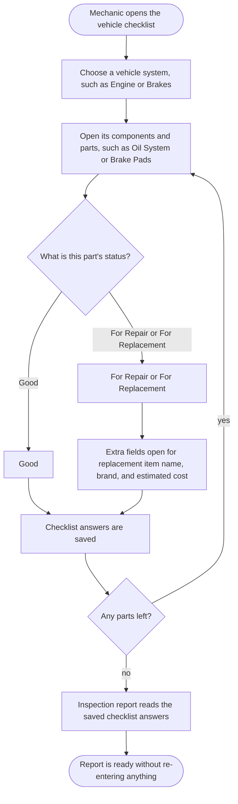

**Reading this:** The mechanic works down a nested list: a vehicle system, then its components, then its parts. Each part gets exactly one of three statuses. Choosing For Repair or For Replacement opens fields for the replacement item name, brand, and estimated cost. The inspection report is then built from those saved answers, so the mechanic never types the same finding twice. Only engine, brakes, and suspension are given as examples, so the approved full list remains [[00 - START HERE#Open questions|Q-27]]. — **REVISIONS LISTS.md**, headings “11. Mechanic Inspection Checklist” through “13. Inspection Report”
