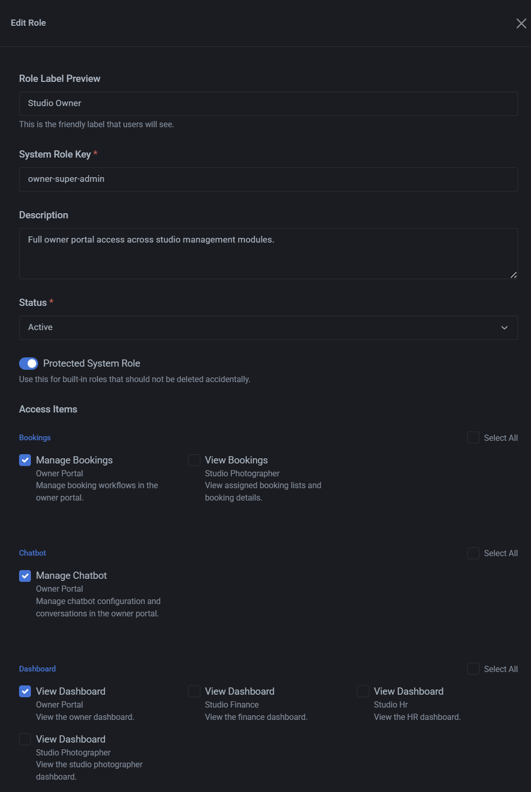

# Revise and expand RBAC management for `/roles`

## Objective

Revise the existing role-based access control (RBAC) workflow, data-entry forms, permission assignment experience, and supporting user interface for the `/roles` module.

The revised module must manage roles and permissions through exactly two primary tabs: **Roles** and **Permission**. Use modal or dialog interfaces for creating records. Role editing must include permission assignment and follow the provided visual reference.

## Implementation role

Act as a full-stack application developer responsible for implementing this RBAC management workflow and its supporting user interface.

## Required behavior

### Roles management

Implement the Roles tab as a sequential workstream with the following behavior:

- Display all created roles in a table.
- Provide a **Create Role** action that opens a modal or dialog instead of navigating away.
- Restrict role creation to these predefined role choices:

  - Supplier
  - Account Manager
  - Head Accountant
  - Confidential Informant
  - Marketing Specialist
  - Mechanic
  - Sales Manager
  - Head Security

- Include these role fields:

  - System Role Key
  - Description
  - Status
  - Protected System Role switch

### Permission management

Implement the Permission tab as a sequential workstream with the following behavior:

- Display all permission records in a table.
- Provide an **Add Permission** action that opens a modal or dialog.
- Structure the form as **Create New Access Rule**.
- Include these fields:

  - Access Area
  - Allowed Action
  - Access Label Preview
  - System Permission Key
  - Description
  - Status

The permission record must contain access-area, action, label, system-key, description, and status information.

### Permission label and key generation

- Use **Access Area** to identify the controlled area or resource. Example values include `user` and `invoice`.
- Use **Allowed Action** to identify the permitted action. Example values include `create` and `read`.
- Display an **Access Label Preview** as a plain-language label that users can understand.
- Generate the **System Permission Key** automatically from the selected access area and allowed action.
- Treat the generated system permission key as an internal identifier, not as the user-facing permission label.
- Include a **Description** field for explaining the behavior allowed by the permission.
- Require a **Status** value for every permission.

### Role editing and permission assignment

- Add an action to each role that allows the role to be edited.
- Within role editing, display the permissions available or applicable to that role.
- Allow permissions to be assigned to or removed from the selected role.
- Display the number of permissions applicable or assigned to the selected role.
- Make permissions created in the Permission tab available for assignment through the role-editing interface.
- Use `public\assets\img\image.png` as the visual reference for the permission-assignment experience.

### Shared interface behavior

- Keep the overall interface simple.
- Use exactly two primary tabs: **Roles** and **Permission**.
- Use table layouts for role and permission records.
- Use modal or dialog interfaces for creating roles and permissions.
- Keep role-specific permission management within the role action or editing workflow.

## Acceptance criteria

1. The `/roles` page contains exactly two primary tabs: **Roles** and **Permission**.
2. The Roles tab displays roles in a table and provides a **Create Role** action that opens a modal or dialog.
3. Role creation restricts the role selection to the eight predefined role choices listed above.
4. Role creation includes the System Role Key, Description, Status, and Protected System Role fields.
5. The Permission tab displays permissions in a table and provides an **Add Permission** action that opens a modal or dialog.
6. Permission creation includes the required access-area, action, label-preview, system-key, description, and status fields.
7. The system permission key is generated automatically from the selected access area and allowed action.
8. Role actions allow an administrator to edit a role and assign or remove applicable permissions.
9. The role-editing permission interface follows the provided reference image.
10. The interface communicates how many permissions are applicable or assigned to each role.

## Constraints

- Restrict role creation to the predefined role choices in this document.
- Generate the system permission key automatically and treat it as an internal identifier.
- Keep the interface centered on the two primary tabs: Roles and Permission.
- Display creation forms through modal or dialog interfaces.
- Use multiple agents only during implementation; do not distribute planning or specification work across multiple agents.

## Multi-agent use

Do not use multiple agents for planning or specification work. Once implementation begins, independent implementation workstreams may be distributed where appropriate, provided that the shared RBAC data structures, role-permission relationships, generated permission keys, and final interface integration remain consistent.
